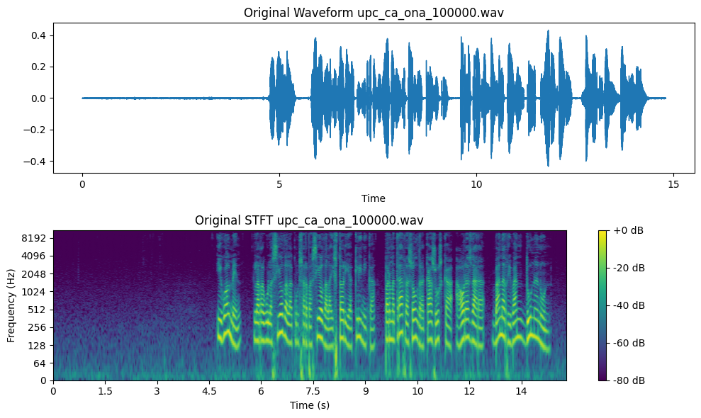
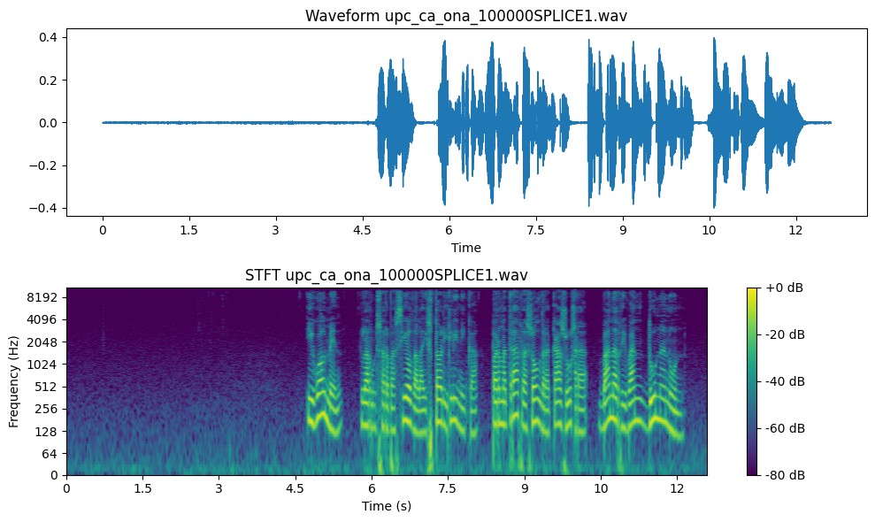
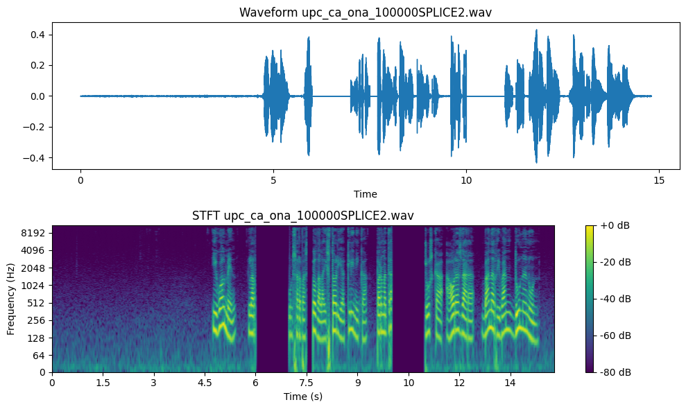
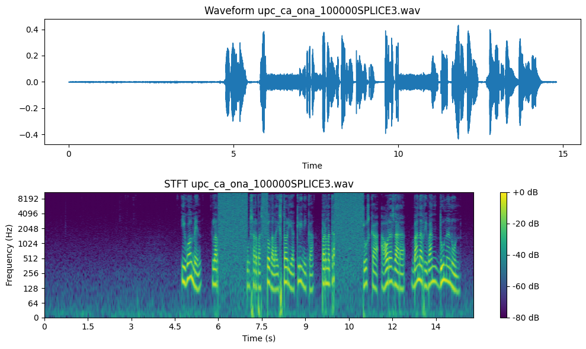
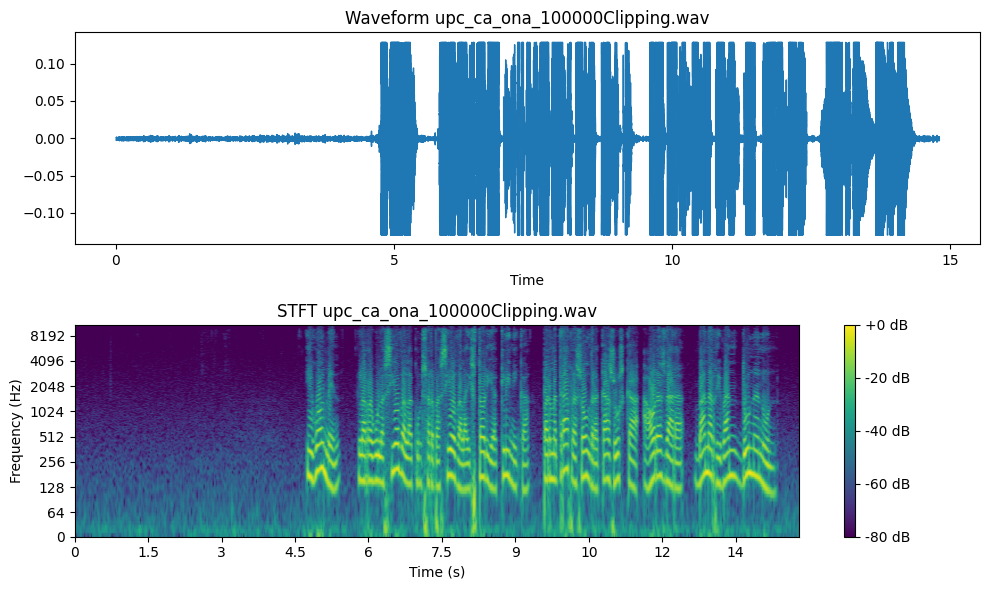

# DA_programV2

DA_programV2 is a data augmentation program that includes several functions for audio processing.

## Installation

This software was developed in Ubuntu 22.04.2 LTS and uses Python 3.10.6.

To install DA_programV2, follow these steps:

1. Clone the repository: `git clone https://github.com/LucasTakanori/DA_programV2`
2. Install the required libraries and dependencies: `pip install -r requirements.txt`
3. Install ffmpeg from `http://ffmpeg.org/download.html`

## Usage

To use DA_programV2, run the main.py script from the src folder. 

First the program will ask for the agumentation methods that we want to use separated by comas.

Second the program will ask for an input tsv file with the original database namefiles and transcriptions.

Third the program will ask for an input folder with the files to augment.

Fourth the program will ask for an output folder where the augmented files will be stored.

Finally the program will ask for the number of times that the database will be augmented.
Here's an example of usage:

```bash
lucastakanori@DESKTOP-5CD06JF:~/DA_programV2/src$ python3 main.py
Enter the augmentation method numbers (1-12) separated by commas: 1,2,3,4
Enter the TSV file path: ../testfiles/RCV/RCV.tsv
Enter the input folder path: ../testfiles/RCV
Enter the output folder path: ../testfiles/test
Enter the number of times you want to augment the database: 2
```

If you need to apply the script multiple times it's faster to hardcode the preferred parameters into the script file.
### EXAMPLE TSV OUTPUT WITH 10 FILES NUM AUGMENTATION = 2

| name_of_the_outputfile                         | transcript                                                                                                              | augmentation_method | randomize_value | difficulty |
| ---------------------------------------------- | ----------------------------------------------------------------------------------------------------------------------- | ------------------- | --------------- | ---------- |
| common_voice_ca_17367931.wav                   | Què, doncs?                                                                                                             |                     |                 |            |
| common_voice_ca_17367675.wav                   | La durada dels projectes no pot sobrepassar els tres anys, des de la data de la sol·licitud.                            |                     |                 |            |
| common_voice_ca_17367896.wav                   | Grapa.                                                                                                                  |                     |                 |            |
| common_voice_ca_17367777.wav                   | Somrigué.                                                                                                               |                     |                 |            |
| common_voice_ca_17367650.wav                   | La distància màxima des del marge fins a la darrera fila de plantes conreades no podrà ser superior a dos-cents metres. |                     |                 |            |
| common_voice_ca_17367588.wav                   | Passa alguna cosa?                                                                                                      |                     |                 |            |
| common_voice_ca_17367950.wav                   | El recordem amb catorze pensaments seus.                                                                                |                     |                 |            |
| common_voice_ca_17367585.wav                   | Tots.                                                                                                                   |                     |                 |            |
| common_voice_ca_17367674.wav                   | Igualment fan rotació de manera consecutiva en horari de matí, tarda i nit.                                             |                     |                 |            |
| common_voice_ca_17367922.wav                   | Oh, Senyor!                                                                                                             |                     |                 |            |
| common_voice_ca_17367931_clipping_1.wav        | Què, doncs?                                                                                                             | clipping            | 20.0            | medium     |
| common_voice_ca_17367675_pitch_shift_1.wav     | La durada dels projectes no pot sobrepassar els tres anys, des de la data de la sol·licitud.                            | pitch_shift         | 0.8             | easy       |
| common_voice_ca_17367896_mp3_compression_1.wav | Grapa.                                                                                                                  | mp3_compression     | 8               | medium     |
| common_voice_ca_17367777_frequency_mask_1.wav  | Somrigué.                                                                                                               | frequency_mask      | 1000.0          | hard       |
| common_voice_ca_17367650_White_noise_1.wav     | La distància màxima des del marge fins a la darrera fila de plantes conreades no podrà ser superior a dos-cents metres. | White_noise         | 40              | easy       |
| common_voice_ca_17367588_Pink_noise_1.wav      | Passa alguna cosa?                                                                                                      | Pink_noise          | 0               | hard       |
| common_voice_ca_17367950_clipping_1.wav        | El recordem amb catorze pensaments seus.                                                                                | clipping            | 1.0             | easy       |
| common_voice_ca_17367585_time_stretch_1.wav    | Tots.                                                                                                                   | time_stretch        | 0.95            | easy       |
| common_voice_ca_17367674_pitch_shift_1.wav     | Igualment fan rotació de manera consecutiva en horari de matí, tarda i nit.                                             | pitch_shift         | 1.2             | easy       |
| common_voice_ca_17367922_vtlp_1.wav            | Oh, Senyor!                                                                                                             | vtlp                | 0.8             | easy       |
|                                                |                                                                                                                         |                     |                 |            |

INSERTAR VIDEO/GIF USAGE

The data augmentation functions implemented in the code are the following:

### `Clipping(filename, outputfile, percentile_threshold=20.0)`
-   This function applies clipping to an audio file. 

    The `filename` parameter is the path to the input audio file. 
    
    The `percentile_threshold` parameter controls the amount of clipping applied to the audio and can range from 0 to 100. The default value is 20.0. 
    
    The function calculates the lower and upper thresholds for clipping based on the specified percentile threshold. The lower threshold is calculated as the value below which a given percentage of the audio samples fall, and the upper threshold is calculated as the value above which a given percentage of the audio samples fall. The function then applies clipping to the audio samples by setting any samples below the lower threshold to the lower threshold value and any samples above the upper threshold to the upper threshold value. the output .wav file is saved using `librosa.output.write_wav`.

### `Equalizer`
-   This function applies a 7-band equalizer to an audio file and saves the equalized audio to a new file. 

    The `filename` parameter is the path to the input audio file. 
    
    The `outputfile` parameter is the path to the output audio file. 
    
    The `gain1` to `gain7` parameters control the gain applied to each of the 7 frequency bands. The default value for each gain parameter is 0. 
    
    The function applies a bandpass filter to each frequency band and multiplies the filtered signal by the corresponding gain value. The function then sums the signals from all 7 frequency bands to produce the equalized audio signal. The function saves the equalized audio signal to the specified output file using the `librosa.output.write_wav` function.


### `Frequency Masking`


### `Mp3compression`
-   This function compresses an audio file using the MP3 codec. 

    The `inputfile` parameter is the path to the input audio file. 
    
    The `quality` parameter controls the quality of the compressed audio and can range from 0 (best) to 9 (worst). The default value is 4, which provides perceptual transparency. 
    
    The function creates a new compressed audio file with the same name as the input file but with an additional suffix indicating the quality level and an ".mp3" extension.

### `Noise Adding`

### `Pitch Shifting`

### `RIR Filtering`

### `Splice Out`
-  This function applies splicing to an audio file and saves the spliced audio to a new file. 

    The `filename` parameter is the path to the input audio file. 
    
    The `outputfile` parameter is the path to the output audio file. 
    
    The `type` parameter controls the type of splicing applied to the audio and can be 1 (delete), 2 (silence), or 3 (noise). 
    
    The `time_ranges` parameter is a list of tuples specifying the start and end times (in seconds) of the regions to be spliced. 
    
    The `snr` parameter controls the signal-to-noise ratio when `type` is set to 3 (noise). The default value for `snr` is 10. 
    
    The function applies the specified type of splicing to the specified time ranges in the audio file and saves the spliced audio signal to the specified output file using the `librosa.output.write_wav` function.

### `Time Stretching`

### `VTLP`
-   This function applies Variable Track Length Perturbation to an audio file and saves the spliced audio to a new file. 

    This function loads the input .wav file using `librosa.load`, computes the spectrogram using `librosa.stft`, and computes the filterbank matrix using librosa.filters.mel. It then applies VTLP to the filterbank matrix using the `vtlp_filter` function. The mel spectrogram is computed using the warped filterbank matrix and inverted to audio using `librosa.feature.inverse.mel_to_audio`. Finally, the output .wav file is saved using `scipy.io.wavfile.write`.

## FUNCTION EFFECTS EXAMPLE

### ORIGINAL AUDIO FILE
[Listen to audio](testfiles/upc_ca_ona_100000.wav)


   
### SPLICE OUT
`Splice_Out: max ranges: 8, max duration: 400ms, snr max: 40db`
        
        splice_out("../testfiles/upc_ca_ona_100000.wav","../resources/upc_ca_ona_100000SPLICE1.wav",1,[(6, 6.2),(7.5 , 7.7),(10, 10.2)])

[Listen to audio](resources/upc_ca_ona_100000SPLICE1.wav)



        splice_out("../testfiles/upc_ca_ona_100000.wav","../resources/upc_ca_ona_100000SPLICE2.wav",2,[(6, 6.2),(7.5 , 7.7),(10, 10.2)])

[Listen to audio](resources/upc_ca_ona_100000SPLICE2.wav)


        splice_out("../testfiles/upc_ca_ona_100000.wav","../resources/upc_ca_ona_100000SPLICE3.wav",3,[(6, 6.2),(7.5 , 7.7),(10, 10.2)])

[Listen to audio](resources/upc_ca_ona_100000SPLICE3.wav)



### MP3 COMPRESSION
`MP3Compression: 0 (best) to 9 (worst) quality`

        mp3compression("../testfiles/upc_ca_ona_100000.wav","../resources/upc_ca_ona_100000mp3.wav", 8)

[Listen to audio](resources/upc_ca_ona_100000mp3.wav)


### VTLP
`VTLP: min alpha: 0.8, max alpha: 1.2`

        vtlp("../testfiles/upc_ca_ona_100000.wav","../resources/upc_ca_ona_100000vtlp.wav",1.2)

[Listen to audio](resources/upc_ca_ona_100000vtlp.wav)


### EQUALIZER
`Equalizer: min gain: -15db, max gain 15db`

        equalizer("../testfiles/upc_ca_ona_100000.wav","../resources/upc_ca_ona_100000EQ.wav",-15,-15,-15,-15,-15,-15,-15)

[Listen to audio](resources/upc_ca_ona_100000EQ.wav)


### CLIPPING
`Clipping: min clipping: 0%, max clipping: 40%`

        clipping("../testfiles/upc_ca_ona_100000.wav","../resources/upc_ca_ona_100000Clipping.wav",5)

[Listen to audio](resources/upc_ca_ona_100000Clipping.wav)


